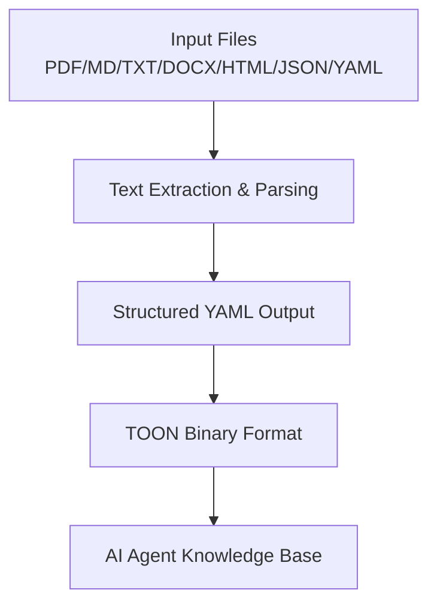

# Janusz

A Python CLI tool that converts documents and structured data to TOON (Token-Oriented Object Notation) format for efficient AI agent knowledge bases and prompt engineering.

## Overview

Janusz provides a complete pipeline for converting various document formats to structured YAML and then optimizing them to TOON format. This enables efficient storage and retrieval of knowledge for AI agents, with significant token compression benefits.

## Features

- **Multi-format Support**: Convert PDF, Markdown, plain text, DOCX, HTML, JSON, and YAML files
- **Structured Output**: Creates well-organized YAML with metadata, content sections, and analysis
- **TOON Optimization**: Converts structured data to compact binary TOON format for AI consumption
- **Automatic TOON CLI Installation**: Automatically installs TOON CLI if missing (via cargo or binary download)
- **Batch Processing**: Process entire directories or individual files
- **Validation**: Built-in validation and testing capabilities
- **CLI Interface**: Comprehensive command-line interface with help and examples

## Quick Start

### Installation

```bash
# Using uv (recommended)
uv sync

# Or using pip
pip install -e .
```


### Basic Usage

```bash
# Place your documents in the 'new' directory, then run:
janusz convert  # Convert documents to YAML
janusz toon     # Convert YAML to TOON (TOON CLI auto-installed if missing)

# Or run the full pipeline:
make all        # Includes automatic TOON CLI installation

# Or use the automated script:
./scripts/toon.sh  # Full pipeline with TOON CLI check/install
```

### Single File Processing

```bash
# Convert a specific document
janusz convert --file document.pdf
janusz toon --file document.yaml

# Test conversion with detailed output
janusz test document.yaml
```

## Supported Formats

| Format | Extension | Status | Dependencies |
|--------|-----------|--------|-------------|
| PDF | `.pdf` | ✅ Core | `pdfplumber` |
| Markdown | `.md` | ✅ Core | - |
| Plain Text | `.txt` | ✅ Core | - |
| JSON | `.json` | ✅ Core | - |
| YAML | `.yaml` | ✅ Core | - |
| DOCX | `.docx` | 🟡 Optional | `python-docx` |
| HTML | `.html` | 🟡 Optional | `html2text`, `beautifulsoup4` |
| RTF | `.rtf` | 🚧 Not Yet Supported | Planned for v1.1.0 |
| EPUB | `.epub` | 🚧 Not Yet Supported | Planned for v1.1.0 |

### Format Support & Roadmap

**Current Support (v1.0.0):**
- ✅ **Fully Supported**: PDF, Markdown, Plain Text, DOCX, HTML, JSON, YAML
- 🟡 **Optional Dependencies**: DOCX (python-docx), HTML (html2text/beautifulsoup4)

**Future Roadmap:**
- 🟢 **v1.1.0**: RTF and EPUB support with dedicated parsers
- 🟢 **v1.1.0**: TOON CLI compatibility versioning and timeouts
- 🟡 **v1.0.1**: Pydantic models for data validation, edge-case tests

## Installation & Setup

### Requirements

- Python 3.8+
- [TOON CLI](https://github.com/toon-format/toon) (automatically installed if missing)

### Dependencies

**Core Dependencies:**
- `pdfplumber>=0.9.0` - PDF text extraction
- `pyyaml>=6.0` - YAML processing

**Optional Dependencies:**
- `python-docx>=1.0.0` - DOCX support
- `html2text>=2020.1.16` - HTML to text conversion
- `beautifulsoup4>=4.12.0` - HTML parsing fallback


### Development Dependencies

- `pytest>=7.0.0` - Testing framework
- `ruff>=0.1.0` - Linting and formatting
- `black>=23.0.0` - Code formatting
- `mypy>=1.0.0` - Type checking


## CLI Commands

### Core Commands

```bash
janusz --help                    # Show help and available commands

# Document conversion
janusz convert                   # Convert all documents in 'new/' to YAML
janusz convert --file path/to/file.pdf  # Convert specific file

# TOON conversion
janusz toon                      # Convert all YAML files in 'new/' to TOON
janusz toon --file path/to/file.yaml    # Convert specific YAML file

# JSON processing
janusz json                      # Convert all JSON files in 'new/' to TOON
janusz json --file path/to/file.json    # Convert specific JSON file
janusz json --no-toon            # Validate JSON files without TOON conversion

# Testing and validation
janusz test path/to/file.yaml    # Test TOON conversion with detailed output
janusz test path/to/file.json    # Test JSON to TOON conversion
```

### Make Commands

```bash
make help        # Show available commands
make install     # Install package in development mode
make convert     # Convert documents to YAML
make toon        # Convert YAML files to TOON (auto-installs TOON CLI)
make json        # Validate JSON files
make json-toon   # Convert JSON files to TOON (auto-installs TOON CLI)
make all         # Full pipeline: Documents → YAML → TOON
make test        # Run test suite
make lint        # Run code linting
make format      # Format code
make check       # Run full quality checks
make clean       # Clean generated files
```

### Automation Scripts

```bash
./scripts/toon.sh  # Full pipeline with automatic TOON CLI installation
```

## Project Structure

```
.
├── src/janusz/                 # Main package
│   ├── __init__.py            # Package initialization
│   ├── cli.py                 # Command-line interface
│   ├── converter.py           # Document to YAML converter
│   ├── toon_adapter.py        # YAML to TOON converter
│   └── json_to_toon.py        # JSON to TOON converter
├── tests/                     # Test suite
│   ├── conftest.py           # Test fixtures
│   ├── test_converter.py     # Document converter tests
│   ├── test_toon_adapter.py  # TOON adapter tests
│   └── test_json_to_toon.py  # JSON to TOON tests
├── docs/                      # Documentation
│   ├── ARCHITECTURE.md       # System architecture
│   └── *.md                  # Additional docs
├── scripts/                   # Automation scripts
│   └── toon.sh              # Full pipeline script
├── pyproject.toml            # Package configuration
├── uv.lock                   # Dependency lock file
├── Makefile                  # Build automation
└── README.md                 # This file
```

## How It Works

### Pipeline Overview

0. **Dependency Check**: Automatically install TOON CLI if missing
1. **Document Processing**: Extract text and structure from input files
2. **YAML Conversion**: Transform content into structured YAML with metadata
3. **TOON Optimization**: Convert YAML to compact TOON binary format
4. **Validation**: Ensure conversion quality and TOON file integrity

### Data Flow



### Output Structure

**YAML Format:**

```yaml
metadata:
  title: "Document Title"
  source: "input.pdf"
  source_type: "pdf"
  converted_by: "Janusz v1.0.0"
  format_version: "2.0"
content:
  sections:
    - title: "Section Header"
      content: ["Content lines..."]
      subsections: []
  raw_text: "Complete document text..."
analysis:
  keywords: ["key", "terms"]
  best_practices: ["Recommendations..."]
  examples: ["Code samples..."]
```

**TOON Format:** Compact binary representation optimized for token efficiency in AI models.


## Development

### Setup

```bash
# Clone repository
git clone https://github.com/Hipson47/Janusz
cd janusz

# Install with development dependencies
uv sync --dev

# Run tests
uv run pytest

# Run quality checks
make check
```

### Development Workflow

1. Create feature branch
2. Write tests for new functionality
3. Implement changes
4. Run full test suite: `make check`
5. Submit pull request

### Code Quality

- **Linting**: `uv run ruff check src/ tests/`
- **Formatting**: `uv run black src/ tests/`
- **Type Checking**: `uv run mypy src/janusz/`
- **Testing**: `uv run pytest tests/`

## Testing

```bash
# Run all tests
uv run pytest

# Run specific test file
uv run pytest tests/test_converter.py

# Run with coverage
uv run pytest --cov=janusz --cov-report=html

# Run tests in verbose mode
uv run pytest -v
```

## Configuration

### Environment Variables

No environment variables are required. The tool works with default settings out of the box.

### File Locations

- **Input Directory**: `new/` (default)
- **Output Directory**: Same as input directory
- **Supported Extensions**: See supported formats table above

## Troubleshooting

### Common Issues

**TOON CLI installation issues:**
```bash
# TOON CLI is automatically installed when needed, but if manual installation is required:
# Via cargo (preferred): cargo install toon
# Or download binary from: https://github.com/toon-format/toon/releases
```

**TOON CLI installation failed:**
```bash
# The automatic installer tries multiple methods:
# 1. Via cargo (if Rust is installed)
# 2. Binary download for your OS/architecture
# 3. Manual installation required if both methods fail

# For manual installation:
curl -L -o toon "https://github.com/toon-format/toon/releases/latest/download/toon-$(uname -s | tr '[:upper:]' '[:lower:]')-$(uname -m)"
chmod +x toon
sudo mv toon /usr/local/bin/  # or add to PATH manually
```

**Missing optional dependencies:**
```bash
# For DOCX support
pip install python-docx

# For HTML support
pip install html2text beautifulsoup4
```

**Permission errors:**
- Ensure write permissions in the working directory
- Check that TOON CLI is executable

**File format errors:**
- Verify file extensions match content type
- Check for corrupted input files
- Use `janusz test` to debug conversion issues


### Getting Help

```bash
janusz --help              # CLI help
make help                  # Make targets
```

## Contributing

1. Fork the repository
2. Create a feature branch
3. Make changes with tests
4. Ensure all checks pass: `make check`
5. Submit a pull request

### Adding New Formats

1. Add format detection in `converter.py`
2. Implement extraction logic
3. Add tests in `tests/test_converter.py`
4. Update documentation


## License

MIT License - see [LICENSE](LICENSE) file for details.

## Related Projects

- [TOON Format](https://github.com/toon-format/toon) - Token-Oriented Object Notation specification
- [pdfplumber](https://github.com/jsvine/pdfplumber) - PDF processing library
- [python-docx](https://github.com/python-openxml/python-docx) - DOCX processing
